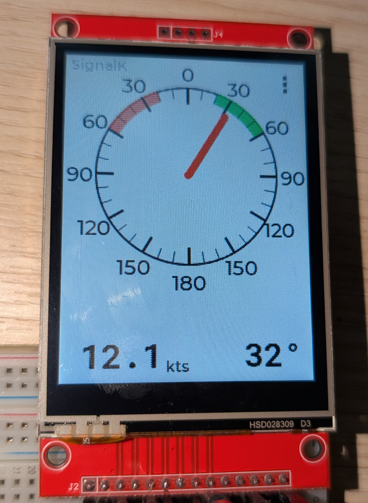
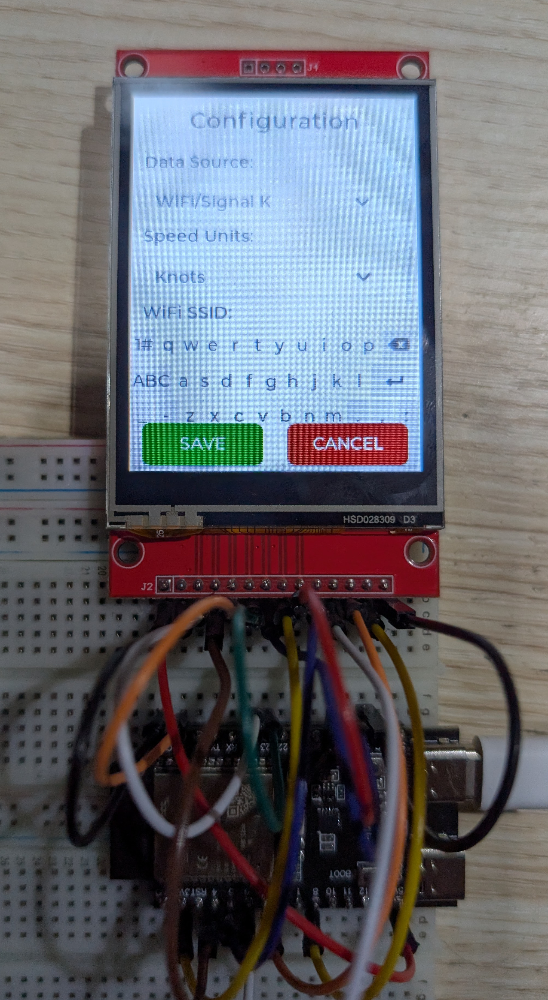

# Yacht Wind Display - ESP32-C6 + ILI9341

A marine wind instrument display for yachts that shows apparent wind speed and direction on a 240x320 touchscreen. Connects to Signal K servers via WiFi to receive real-time wind data from onboard instruments.

## Screenshots

<p align="left">
  
  
</p>

**Left:** Real-time wind speed and direction with compass rose, cardinal points, and port/starboard optimal angle indicators.  
**Right:** Touch-based configuration menu with on-screen keyboard for WiFi, Signal K server, data source, and units settings.

## Features

- **Real-time Wind Display**: Shows wind speed and direction with a compass rose and arrow indicator
- **Multiple Data Sources**:
  - WiFi/Signal K WebSocket connection
  - Demo mode for testing
  - Extensible architecture for NMEA 0183, Bluetooth LE, NMEA 2000
- **Configurable Units**: Knots, m/s, mph, or km/h
- **Touch Interface**: On-screen configuration menu with keyboard
- **Port/Starboard Indicators**: Visual red/green sectors showing optimal sailing angles (20-60°)
- **Persistent Settings**: Configuration saved to ESP32 NVS (non-volatile storage)

## Hardware Requirements

### Components

- **ESP32-C6 Development Board** (e.g., ESP32-C6-DevKitC-1)
- **ILI9341 2.4" TFT LCD Display** (240x320 pixels, SPI interface)
- **XPT2046 Touch Controller** (usually integrated with ILI9341 displays)
- Jumper wires
- USB-C cable for programming

### Wiring Diagram

#### Display (ILI9341) Connections

| ILI9341 Pin | ESP32-C6 Pin | Description |
|-------------|--------------|-------------|
| VCC         | 3.3V         | Power supply |
| GND         | GND          | Ground |
| CS          | GPIO 15      | Chip select |
| RESET       | GPIO 4       | Reset |
| DC/RS       | GPIO 2       | Data/Command |
| SDI/MOSI    | GPIO 23      | SPI MOSI |
| SCK         | GPIO 18      | SPI Clock |
| LED         | 3.3V         | Backlight (or PWM pin for dimming) |
| SDO/MISO    | -            | Not used |

#### Touch Controller (XPT2046) Connections

| XPT2046 Pin | ESP32-C6 Pin | Description |
|-------------|--------------|-------------|
| T_CLK       | GPIO 5       | Touch SPI Clock |
| T_CS        | GPIO 6       | Touch Chip Select |
| T_DIN       | GPIO 7       | Touch MOSI |
| T_DO        | GPIO 8       | Touch MISO |
| T_IRQ       | GPIO 9       | Touch Interrupt |

**Note**: The touch controller uses a separate SPI bus (FSPI) from the display to avoid conflicts.

### Power Considerations

- The ESP32-C6 and display can be powered via USB (5V) during development
- For marine installation, use a 12V to 5V DC-DC converter connected to the boat's electrical system
- Total current draw: ~200-300mA at 5V

## Software Requirements

### Arduino IDE Setup

1. **Install Arduino IDE** (version 2.0 or later recommended)
   - Download from: <https://www.arduino.cc/en/software>

2. **Install ESP32 Board Support**
   - Open Arduino IDE
   - Go to `File > Preferences`
   - Add to "Additional Board Manager URLs":

     ```
     https://espressif.github.io/arduino-esp32/package_esp32_index.json
     ```

   - Go to `Tools > Board > Boards Manager`
   - Search for "esp32" and install "esp32" by Espressif Systems (version 3.0.0 or later)

3. **Install Required Libraries**

   Go to `Tools > Manage Libraries` and install:

   - **lvgl** (version 9.4.0 or later) - Graphics library
   - **Adafruit GFX Library** - Graphics primitives
   - **Adafruit ILI9341** - Display driver
   - **XPT2046_Touchscreen** - Touch controller driver
   - **WebSockets** by Markus Sattler - WebSocket client for Signal K
   - **ArduinoJson** (version 6 or 7) - JSON parsing

### Board Configuration

1. Select board: `Tools > Board > esp32 > ESP32C6 Dev Module`
2. Configure partition scheme: `Tools > Partition Scheme > 8MB with spiffs`
   - **Important**: The default 4MB partition is too small. You must use 8MB.
3. Select port: `Tools > Port > [your ESP32-C6 port]`
4. Other settings (defaults are fine):
   - Flash Mode: QIO
   - Flash Frequency: 80MHz
   - Upload Speed: 921600

## Building and Flashing

### First Time Setup

1. **Clone or download this repository**

   ```bash
   cd ~/Arduino
   git clone [repository-url] esp32-yacht-wind-instrument
   ```

2. **Generate custom fonts** (already included, but if you need to regenerate):

   ```bash
   cd esp32-yacht-wind-instrument
   npx lv_font_conv --no-compress --no-prefilter --bpp 4 --size 24 \
     --font /path/to/RobotoMono-SemiBold.ttf \
     -r 0x20-0x7E,0xB0 \
     --format lvgl -o roboto_mono_semibold_24.c
   ```

3. **Open the project**
   - Launch Arduino IDE
   - Open `esp32-yacht-wind-instrument.ino`

4. **Verify compilation**
   - Click the checkmark icon (Verify)
   - Should compile without errors
   - Sketch size should be ~1.2-1.5MB (well under the 3MB limit with 8MB partition)

5. **Upload to ESP32-C6**
   - Connect ESP32-C6 via USB-C
   - Click the arrow icon (Upload)
   - Wait for "Hard resetting via RTS pin..." message
   - Display should initialize and show demo wind data

### Troubleshooting Compilation

**"Sketch too big" error:**

- Make sure you selected `8MB with spiffs` partition scheme
- Go to `Tools > Partition Scheme > 8MB with spiffs`

**Library not found errors:**

- Verify all required libraries are installed
- Check library versions match requirements

**Display shows nothing:**

- Check wiring connections
- Verify 3.3V power is connected
- Try adjusting display contrast (if available)

## Configuration

### Initial Setup

1. **Power on the device** - You'll see demo wind data (rotating arrow)

2. **Open configuration menu**
   - Tap the three dots (...) button in the top-right corner

3. **Configure WiFi**
   - Tap "WiFi SSID" field and enter your network name
   - Tap "WiFi Password" field and enter password
   - Use the on-screen keyboard (appears when field is focused)

4. **Configure Signal K Server**
   - Enter Signal K server IP address (e.g., `192.168.1.100`)
   - Enter port number (default: `3000`)

5. **Select Data Source**
   - Choose "WiFi/Signal K" from dropdown

6. **Select Units**
   - Choose preferred wind speed units: Knots, m/s, mph, or km/h

7. **Save Configuration**
   - Tap "SAVE" button
   - Settings are stored in ESP32 NVS (survives reboots)
   - Device will restart data source with new settings

### Status Indicators

The small text at the top center shows connection status:

- **Demo** - Running in demo mode (simulated data)
- **WiFi...** - Attempting to connect to WiFi
- **WiFi OK** - Connected to WiFi, connecting to Signal K
- **SignalK** - Fully connected and receiving wind data

## Signal K Integration

### Server Requirements

- Signal K server version 1.x or 2.x
- WebSocket endpoint enabled (default port 3000)
- Wind data paths available:
  - `environment.wind.speedApparent` (in m/s)
  - `environment.wind.angleApparent` (in radians)

### Subscription

The display subscribes to wind data with 1-second update intervals:

```json
{
  "context": "vessels.self",
  "subscribe": [
    {
      "path": "environment.wind.speedApparent",
      "period": 1000
    },
    {
      "path": "environment.wind.angleApparent",
      "period": 1000
    }
  ]
}
```

### Data Format

Signal K sends delta updates:

```json
{
  "context": "vessels.urn:mrn:signalk:uuid:...",
  "updates": [{
    "$source": "nmea.0183",
    "timestamp": "2025-12-28T04:47:18.990Z",
    "values": [
      {
        "path": "environment.wind.speedApparent",
        "value": 6.43
      },
      {
        "path": "environment.wind.angleApparent",
        "value": 0.7854
      }
    ]
  }]
}
```

## Architecture

### Data Source Abstraction

The project uses an extensible architecture for different data sources:

```
WindDataSource (abstract interface)
├── DemoWindDataSource (simulated data)
├── SignalKWindDataSource (WiFi + WebSocket)
├── NMEAWindDataSource (planned - serial NMEA 0183)
├── BLEWindDataSource (planned - Bluetooth LE)
└── NMEA2000WindDataSource (planned - CAN bus)
```

### Key Components

- **WindDataSourceManager**: Manages switching between data sources
- **WindConfig**: Handles configuration storage/retrieval from NVS
- **ConfigScreen**: Touch-based configuration UI with LVGL
- **SignalKWindDataSource**: WiFi and WebSocket client for Signal K

### Display Layout

- **Compass Rose**: 180px diameter circle centered at (120, 120)
- **Wind Arrow**: Dynamic arrow pointing to wind direction
- **Cardinal Points**: N, E, S, W labels at 105px radius
- **Port/Starboard Arcs**: Red (port) and green (starboard) 20-60° sectors
- **Wind Speed**: Top-left with units label
- **Wind Angle**: Top-right in degrees
- **Status**: Top-center connection indicator
- **Menu Button**: Top-right three-dot button

## Customization

### Changing Fonts

Custom fonts are generated with `lv_font_conv`. To use different fonts:

1. Install lv_font_conv: `npm install -g lv_font_conv`
2. Generate font file (see "First Time Setup" section)
3. Update font declarations in `.ino` file
4. Update font references in display code

### Adding New Data Sources

1. Create new class inheriting from `WindDataSource`
2. Implement required methods: `begin()`, `update()`, `stop()`, `isConnected()`, `getWindSpeed()`, `getWindAngle()`, `getSourceName()`
3. Add to `DataSourceType` enum
4. Update `restartDataSource()` function
5. Add UI option in ConfigScreen

### Adjusting Display Colors

Colors are defined using LVGL color functions:

- `lv_color_hex(0xRRGGBB)` - RGB hex color
- `lv_palette_main(LV_PALETTE_RED)` - Predefined palette colors

## Marine Installation

### Mounting

- Use waterproof enclosure rated for marine environment (IP65 or better)
- Mount in cockpit or helm position with good visibility
- Avoid direct sunlight on display (use sunshade if needed)
- Ensure touch screen is accessible

### Power

- Connect to boat's 12V system via DC-DC converter (12V → 5V, 2A minimum)
- Add inline fuse (2A) for protection
- Use marine-grade wire and connectors
- Consider adding power switch

### Networking

- Connect to boat's WiFi network (same network as Signal K server)
- For best reliability, use dedicated marine WiFi router
- Consider WiFi range extender if server is far from display

## Troubleshooting

### Display Issues

**Blank screen:**

- Check power connections (3.3V and GND)
- Verify wiring matches pinout table
- Check backlight connection

**Garbled display:**

- Verify SPI pins are correct
- Check for loose connections
- Try lower SPI frequency in code

**Touch not working:**

- Verify touch controller wiring
- Check T_IRQ connection
- Calibrate touch if needed (see XPT2046 library docs)

### WiFi Issues

**Won't connect to WiFi:**

- Verify SSID and password are correct
- Check WiFi signal strength
- Ensure 2.4GHz network (ESP32-C6 doesn't support 5GHz)
- Check router allows new device connections

**Connects to WiFi but not Signal K:**

- Verify Signal K server IP address
- Check port number (default 3000)
- Ensure Signal K server is running
- Check firewall settings on server

### Data Issues

**No wind data:**

- Check Signal K server has wind data available
- Verify paths: `environment.wind.speedApparent` and `environment.wind.angleApparent`
- Check Serial Monitor (115200 baud) for debug messages
- Ensure wind instrument is connected to Signal K

**Incorrect wind values:**

- Check unit conversion settings
- Verify Signal K is sending data in correct units (m/s for speed, radians for angle)
- Check for multiple data sources in Signal K (may need filtering)

## Serial Monitor Debugging

Connect to Serial Monitor at 115200 baud to see debug output:

```
[Restart] Starting data source restart
[Restart] Target source type: 1
[Restart] Switching to SignalK
[Restart] Creating new SignalK source
[SignalK] Constructor called, instance=0x40835d7c
[SignalK] Starting WiFi connection...
[SignalK] WiFi connected
[SignalK] WebSocket connected
[SignalK] Wind speed: 6.43 m/s
[SignalK] Wind angle: 45.0°
```

## License

GNU General Public License v3.0 or later
 https://www.gnu.org/licenses/gpl-3.0.en.html#license-text

## Credits

- LVGL graphics library: <https://lvgl.io/>
- Adafruit libraries: <https://github.com/adafruit>
- Signal K: <https://signalk.org/>
- ESP32 Arduino Core: <https://github.com/espressif/arduino-esp32>

